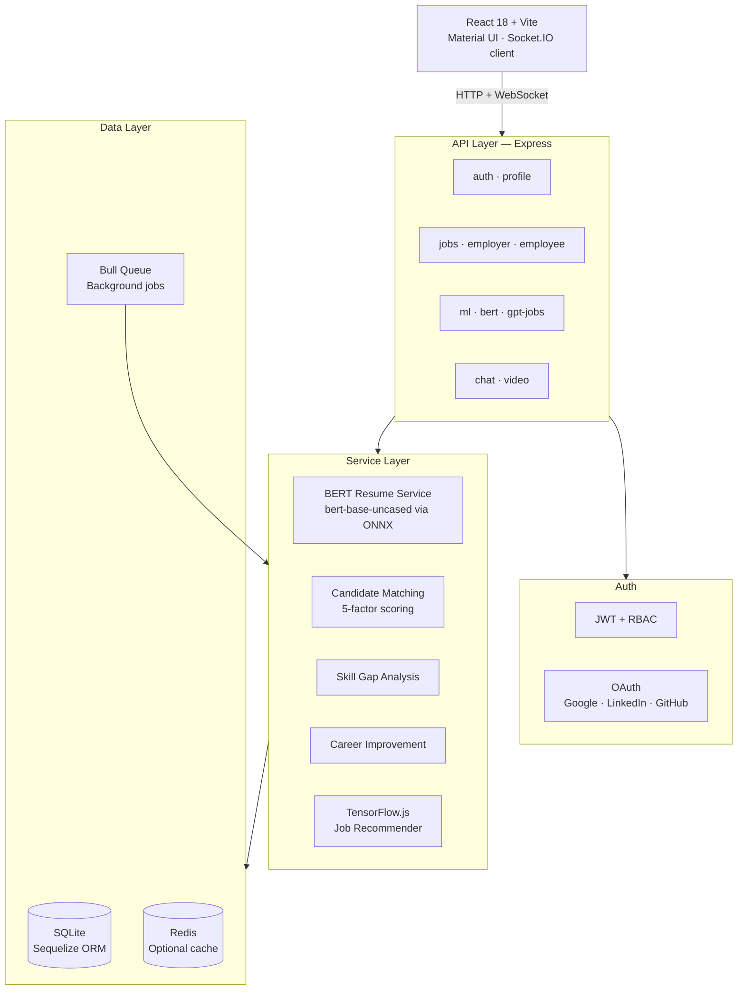
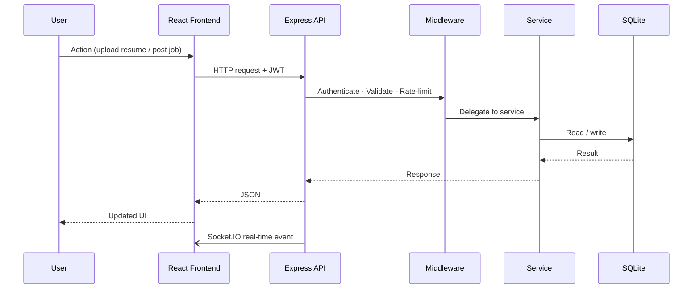

<div align="center">

# CareerConnect AI

**AI-powered hiring platform for job seekers and employers**

Resume intelligence · Smart candidate matching · Real-time communication · Full recruitment workflow

[](https://nodejs.org)
[](https://react.dev)
[](https://sequelize.org)
[](https://socket.io)
[](./LICENSE)

</div>

---

## What it does

| For job seekers | For employers |
|---|---|
| Upload a resume → instant skill gap analysis, quality score, and tailored job recommendations | Post a job → AI-matched candidates ranked by a 5-factor scoring algorithm |
| Track applications and schedule interviews | Filter candidates, manage the full hiring pipeline |
| Real-time chat with employers | Real-time chat with candidates |

---

## Architecture



---

## Request flow



---

## Stack

| Layer | Technology |
|---|---|
| **Backend** | Node.js 18+, Express, Sequelize, SQLite |
| **Frontend** | React 18, Vite, Material UI v5, React Query |
| **AI / NLP** | BERT (`bert-base-uncased` via `@xenova/transformers`), TensorFlow.js, `natural` |
| **Auth** | JWT, Passport.js, OAuth 2.0 (Google · LinkedIn · GitHub), RBAC |
| **Real-time** | Socket.IO 4 |
| **Background** | Bull queue, Redis (optional) |
| **Infra** | Docker, PM2, Nginx |

---

## File structure

```
careerconnect-ai/
├── src/
│   ├── server/
│   │   ├── index.js              # Express bootstrap, Socket.IO, route loader
│   │   └── passport.js           # JWT + OAuth strategies
│   │
│   ├── routes/                   # Route modules (12 total)
│   │   ├── auth.js               # Register, login, OAuth callbacks, refresh
│   │   ├── jobs.js               # Job search, recommendations
│   │   ├── employer.js           # Job posting, candidate pipeline, analytics
│   │   ├── employee.js           # Applications, interviews, salary insights
│   │   ├── bertRoutes.js         # BERT parse, skill-gaps, job comparison
│   │   ├── ml.js                 # Resume parsing, market insights
│   │   ├── chat.js               # Conversations, messages
│   │   ├── video.js              # Interview scheduling, Meet links
│   │   ├── resume.js             # Resume CRUD
│   │   ├── profile.js            # Profile management, export
│   │   ├── gpt-jobs.js           # GPT-enhanced job features
│   │   └── linkedin-jobs.js      # LinkedIn job integration
│   │
│   ├── services/                 # Business logic
│   │   ├── bertResumeService.js  # BERT embeddings, section detection, skill extraction
│   │   ├── bertCacheService.js   # SHA-256 keyed result cache
│   │   ├── bertPoolManager.js    # Request orchestration + stats
│   │   ├── candidateMatchingService.js  # 5-factor scoring (skills 40%, exp 25%, location 15%, edu 10%, salary 10%)
│   │   ├── candidateRatingService.js    # Comprehensive candidate rating
│   │   ├── skillGapAnalysisService.js   # Gap detection, learning paths, salary impact
│   │   ├── careerImprovementService.js  # 8-area career suggestions
│   │   ├── enhancedJobRecommendationService.js
│   │   ├── gptOssService.js      # LLM integration
│   │   ├── gmeetService.js       # Google Meet link generation
│   │   └── linkedinService.js    # LinkedIn API
│   │
│   ├── ml/
│   │   ├── resumeParser.js       # PDF/TXT → BERT pipeline entry point
│   │   ├── resumeAnalyzer.js     # AI-powered resume analysis
│   │   ├── jobRecommender.js     # TF.js neural collaborative filtering
│   │   └── tensorflowService.js  # TF.js model definitions
│   │
│   ├── models/                   # Sequelize models
│   │   ├── User.js               # Roles: jobseeker · employer · admin
│   │   ├── Job.js
│   │   ├── Resume.js
│   │   ├── Conversation.js
│   │   ├── Message.js
│   │   └── Interview.js
│   │
│   ├── middleware/
│   │   ├── auth.js               # authenticateToken, authorizeRole, optionalAuth
│   │   ├── rateLimiter.js        # Per-route rate limiters
│   │   ├── security.js           # Helmet, CORS, sanitization
│   │   ├── validation.js         # express-validator helpers
│   │   ├── csrf.js
│   │   ├── errorHandler.js
│   │   └── logger.js             # Winston structured logging
│   │
│   ├── database/
│   │   ├── sequelize.js          # SQLite connection + model sync
│   │   ├── redis.js              # Optional Redis connection
│   │   └── sqljs-shim.js
│   │
│   ├── workers/
│   │   ├── jobQueue.js           # Bull queue processors
│   │   └── fileCleanup.js        # Temp upload cleanup
│   │
│   ├── utils/
│   │   └── inputSanitizer.js
│   │
│   └── client/                   # React frontend
│       └── src/
│           ├── pages/
│           │   ├── Auth/         # Login, Register, ForgotPassword, ResetPassword
│           │   ├── Employee/     # Dashboard, Applications, CareerImprovement, Interviews
│           │   ├── Employer/     # Dashboard, JobPosting, JobManagement, Candidates, Analytics
│           │   ├── Jobs/         # Search, Recommendations, Details
│           │   ├── Resume/       # Upload, Analysis, Edit
│           │   ├── Chat/
│           │   ├── Video/
│           │   └── Profile/
│           ├── contexts/         # Auth, Socket, App, Job, Resume
│           ├── services/         # API client modules
│           ├── hooks/            # useDebouncedValue, useOAuthFlow, useReducedMotion
│           └── theme/            # Material UI theme, colors, typography
│
├── scripts/
│   ├── setup.js                  # First-run setup
│   ├── reset-users.js            # Seed test accounts
│   ├── seed-test-users.js
│   └── test-integration.js
│
├── uploads/                      # Runtime file storage
│   ├── resumes/
│   ├── avatars/
│   └── temp/
│
├── .env.example
├── docker-compose.yml
├── Dockerfile
├── ecosystem.config.js           # PM2 config
└── nginx.conf
```

---

## Get started

```bash
git clone https://github.com/BugHunterX2101/careerconnect-ai.git
cd careerconnect-ai
cp .env.example .env          # fill in JWT_SECRET at minimum
npm install
cd src/client && npm install && cd ../..
npm run build:client
npm start
```

| Endpoint | URL |
|---|---|
| App | http://localhost:3000 |
| API | http://localhost:3000/api |
| Health | http://localhost:3000/health |
| Socket | ws://localhost:3000 |

**Dev mode** — hot reload on both backend and frontend:
```bash
npm run dev                        # backend → port 3000
cd src/client && npm run dev       # frontend → port 5173
```

**Test accounts** — seed with `node scripts/reset-users.js`:
- Job seeker: `test@test.com` / `test123`
- Employer: `employer@test.com` / `employer123`

---

## Environment

```bash
# Required
PORT=3000
NODE_ENV=production
JWT_SECRET=your-256-bit-secret
CLIENT_URL=http://localhost:3000

# OAuth — all optional, each provider degrades gracefully if unconfigured
GOOGLE_CLIENT_ID=
GOOGLE_CLIENT_SECRET=
LINKEDIN_CLIENT_ID=
LINKEDIN_CLIENT_SECRET=
GITHUB_CLIENT_ID=
GITHUB_CLIENT_SECRET=

# AI — GPT features disabled if absent, BERT runs locally without a key
OPENAI_API_KEY=

# Redis — caching and Bull queue; app runs without it (queues fall back to sync)
REDIS_URL=redis://localhost:6379
```

See [`OAUTH_SETUP_GUIDE.md`](./OAUTH_SETUP_GUIDE.md) and [`REDIS_SETUP.md`](./REDIS_SETUP.md) for detailed setup.

---

## Key API routes

```
# AI / Resume
POST  /api/ml/parse-resume          BERT resume parsing → skills + job recommendations
POST  /api/bert/skill-gaps          Skill gap analysis with learning paths
POST  /api/bert/compare-job         Resume ↔ job description match score
GET   /api/bert/high-paying-skills  Top skill recommendations by salary impact

# Auth
POST  /api/auth/register            Register with role selection (jobseeker | employer)
POST  /api/auth/login
GET   /api/auth/google              OAuth — Google
GET   /api/auth/linkedin            OAuth — LinkedIn
GET   /api/auth/github              OAuth — GitHub
POST  /api/auth/refresh             Refresh JWT

# Jobs
GET   /api/jobs/recommendations     AI-ranked job recommendations
GET   /api/jobs/search              Filter by skills, location, salary, type
POST  /api/jobs/:id/apply           Apply for a job

# Employer
POST  /api/employer/jobs            Post job → instant AI candidate matching
GET   /api/employer/candidates/:id  Ranked candidate list for a job
GET   /api/employer/analytics       Hiring funnel analytics

# Communication
GET   /api/chat/conversations       Conversation list
POST  /api/chat/conversations/:id/messages   Send message (also via Socket.IO)
POST  /api/video/interviews         Schedule interview
GET   /api/video/meet-link/:id      Get Google Meet link

# System
GET   /health                       Service status (DB, Redis, AI warmup)
```

---

## Candidate scoring algorithm

```
Total Score (0–100) =
  Skills match      40%   (required skills covered by candidate)
  Experience        25%   (years vs. seniority level required)
  Location          15%   (city/remote match)
  Education         10%   (degree level match)
  Salary fit        10%   (expected vs. offered range)
```

---

## Deploy

```bash
# Docker (recommended)
docker-compose up -d

# PM2
npm run build:client
npm run start:pm2

# Manual
npm run build:client && npm start
```

---

## Docs

| File | Contents |
|---|---|
| [`BERT_INTEGRATION.md`](./BERT_INTEGRATION.md) | BERT pipeline — model, embeddings, section detection, skill extraction |
| [`OAUTH_SETUP_GUIDE.md`](./OAUTH_SETUP_GUIDE.md) | Configuring Google, LinkedIn, and GitHub OAuth providers |
| [`REDIS_SETUP.md`](./REDIS_SETUP.md) | Redis for caching, Bull queues, and session management |
