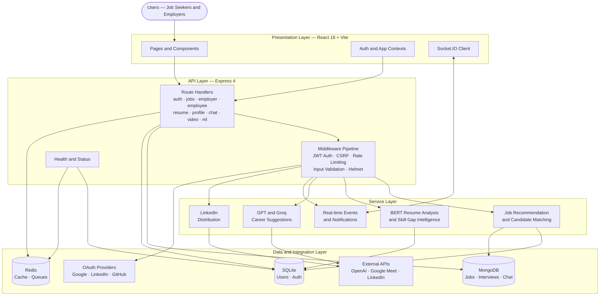
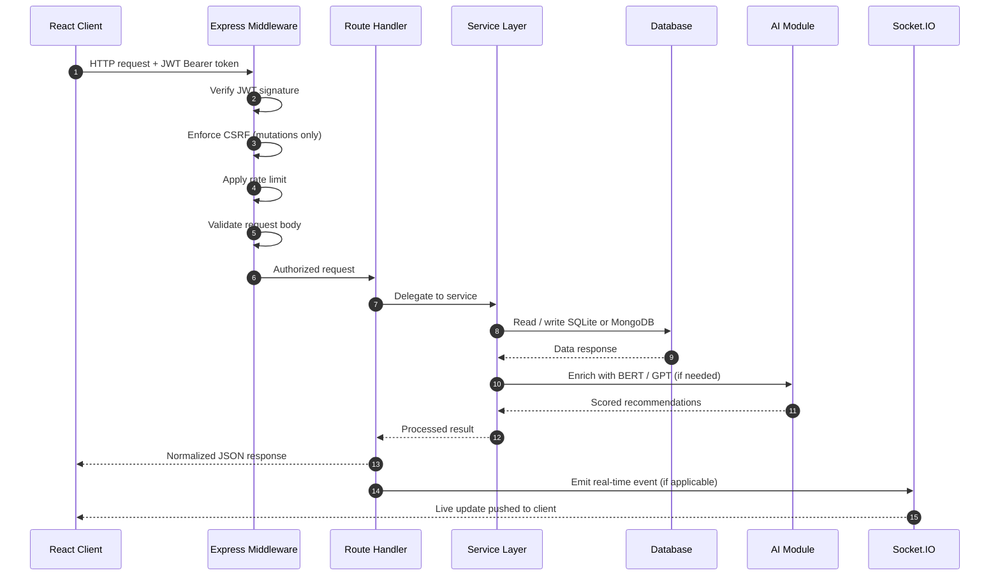
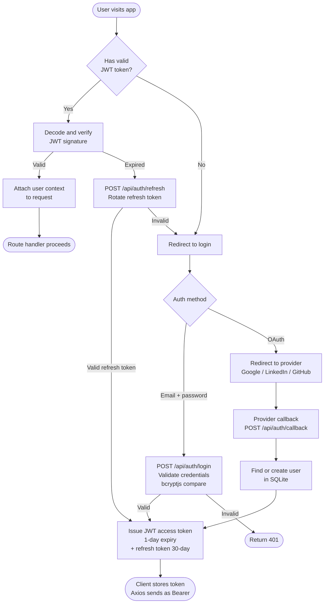
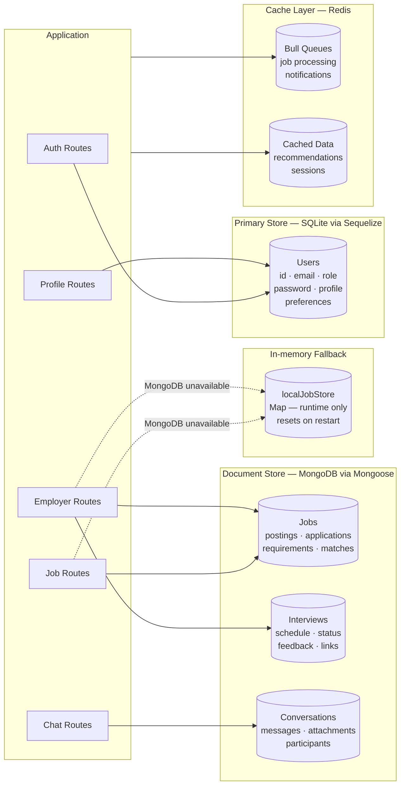
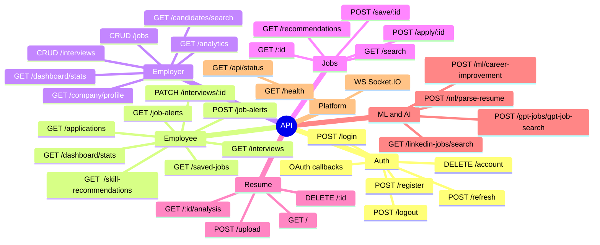
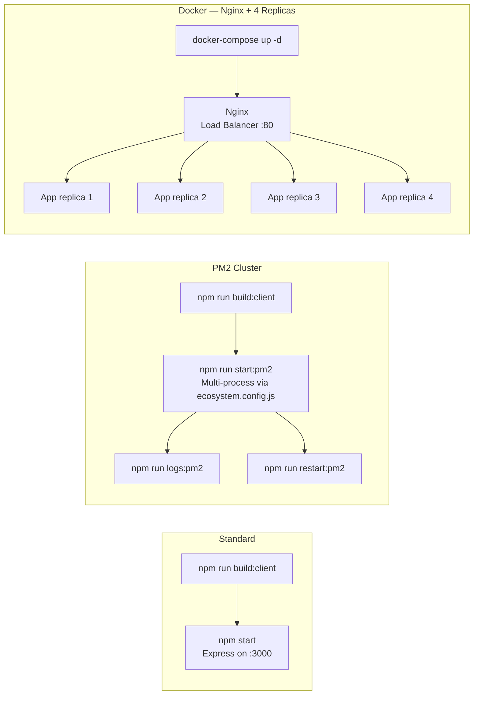
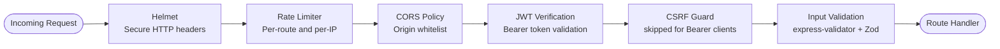

# CareerConnect AI

**An AI-powered career platform that connects talent with opportunity.**

[](https://nodejs.org)
[](https://react.dev)
[](https://expressjs.com)
[](https://github.com/BugHunterX2101/careerconnect-ai)
[](LICENSE)

---

CareerConnect AI is a full-stack hiring and job-search platform that brings together AI resume intelligence, smart candidate matching, real-time chat, and video interviews — all in one application. It ships with SQLite out of the box; MongoDB and Redis are optional and fail gracefully when unavailable.

---

## Table of Contents

- [Features](#features)
- [Tech Stack](#tech-stack)
- [System Architecture](#system-architecture)
- [Request Lifecycle](#request-lifecycle)
- [Authentication Flow](#authentication-flow)
- [Data Architecture](#data-architecture)
- [File Structure](#file-structure)
- [API Routes](#api-routes)
- [Quick Start](#quick-start)
- [Configuration](#configuration)
- [Development](#development)
- [Production Deployment](#production-deployment)
- [Testing and Linting](#testing-and-linting)
- [Security](#security)
- [Troubleshooting](#troubleshooting)

---

## Features

### For Job Seekers

| Capability | Details |
| --- | --- |
| AI Resume Analysis | BERT + Universal Sentence Encoder parses and scores your resume against job requirements |
| Smart Recommendations | Jobs sourced from three independent channels: internal DB, LinkedIn feed, and GPT-generated listings |
| One-Click Applications | Apply with your resume and cover letter in a single action |
| Interview Management | Schedule, confirm, or decline interviews; join via Google Meet |
| Career Intelligence | ML-powered skill-gap analysis and career improvement suggestions |
| Real-time Chat | Communicate with recruiters instantly via Socket.IO-powered messaging |
| Job Alerts | Set keyword and location alerts; receive daily or weekly digests |
| Multi-language UI | Full i18n support via react-i18next |

### For Employers

| Capability | Details |
| --- | --- |
| Job Posting | Post jobs with automatic LinkedIn distribution |
| AI Candidate Matching | Ranked candidate shortlists based on skill alignment |
| Applicant Pipeline | Track applicants through stages: applied, screened, interviewed, hired |
| Interview Scheduling | Calendar-based scheduling with automated candidate notifications |
| Analytics Dashboard | Hiring funnel metrics, time-to-hire, and source attribution |
| Candidate Search | Skill and keyword search across the full candidate pool |
| Company Profile | Public employer branding page for candidates |
| Team Management | Invite and manage hiring team members |

### Platform Capabilities

| Capability | Details |
| --- | --- |
| Authentication | JWT with refresh-token rotation + OAuth via Google, LinkedIn, GitHub |
| Security | CSRF protection, helmet headers, per-route rate limiting, input validation |
| Storage | Hybrid: SQLite for users/auth, MongoDB for jobs/interviews/chat |
| Caching | Redis + Bull job queues (optional, graceful fallback) |
| Real-time | Socket.IO for chat messages and live notifications |
| File Handling | Multer with type and size validation for resumes and avatars |

---

## Tech Stack

| Layer | Technology |
| --- | --- |
| Runtime | Node.js 18+, Express 4 |
| Frontend | React 18, Vite, Material UI v5, React Router v6 |
| State and Data | React Query, React Hook Form, Axios |
| Real-time | Socket.IO (server and client) |
| Animation and 3D | Framer Motion, Three.js via `@react-three/fiber` |
| Charts | Recharts |
| Auth | Passport.js (JWT, Google, LinkedIn, GitHub), bcryptjs |
| Primary DB | SQLite via Sequelize |
| Document DB | MongoDB via Mongoose (optional) |
| Cache and Queues | Redis + Bull (optional) |
| AI and ML | TensorFlow.js, Universal Sentence Encoder, OpenAI API, Groq |
| PDF | pdf-parse (server), react-pdf (client) |
| Validation | express-validator, Zod |
| Logging | Winston |
| Process Management | PM2, Docker + Nginx |

---

## System Architecture

The platform is structured in four distinct layers: presentation, API, service, and data. Each layer has a single responsibility and communicates only with its adjacent layer.



---

## Request Lifecycle

Every API call follows the same deterministic path through the stack.



---

## Authentication Flow

JWT and OAuth work together to provide secure, stateless authentication across all clients.



---

## Data Architecture

CareerConnect AI uses a hybrid storage model purpose-built for each data domain.



---

## File Structure

```text
careerconnect-ai/
├── src/
│   ├── client/                    # React 18 frontend (Vite)
│   │   └── src/
│   │       ├── components/        # Layout, ErrorBoundary, Auth guards, shared UI
│   │       ├── contexts/          # AuthContext, AppContext, SocketContext
│   │       ├── hooks/             # useDebouncedValue, useOAuthFlow, useReducedMotion
│   │       ├── pages/             # Route-level pages
│   │       │   ├── Auth/          # Login, Register, ForgotPassword, ResetPassword
│   │       │   ├── Employee/      # Dashboard, Applications, Interviews, Career
│   │       │   ├── Employer/      # Dashboard, Jobs, Candidates, Analytics
│   │       │   ├── Jobs/          # Search, Recommendations, Detail
│   │       │   ├── Resume/        # Upload, Analysis, Edit
│   │       │   └── ...
│   │       ├── services/          # Axios API clients (authService, jobService, ...)
│   │       ├── theme/             # Material UI theme configuration
│   │       ├── App.jsx            # Route composition with lazy loading
│   │       └── main.jsx           # Application entrypoint
│   ├── config/                    # Shared server configuration
│   ├── database/                  # DB initialization and model wiring
│   ├── middleware/                # JWT auth, CSRF, rate limiting, error handling
│   ├── ml/                        # TensorFlow and BERT runtime helpers
│   ├── models/                    # Sequelize (User) and Mongoose (Job, Interview, Chat)
│   ├── routes/                    # Express route modules
│   ├── server/                    # Express bootstrap, Passport strategies, Socket.IO
│   ├── services/                  # Business and AI orchestration services
│   ├── utils/                     # Shared backend utilities
│   ├── workers/                   # Background job processors (Bull queues)
│   └── __tests__/                 # Backend tests (Jest)
├── scripts/                       # Setup, seed, test, and operational scripts
├── uploads/                       # Runtime file storage (resumes, avatars)
├── Dockerfile
├── docker-compose.yml             # Nginx load balancer + 4 app replicas
└── ecosystem.config.js            # PM2 cluster configuration
```

---

## API Routes



| Prefix | Module | Responsibility |
| --- | --- | --- |
| `/api/auth` | `auth.js` | Registration, login, token refresh, OAuth callbacks, account deletion |
| `/api/employee` | `employee.js` | Dashboard, applications, saved jobs, alerts, interviews, skill recommendations |
| `/api/employer` | `employer.js` | Job CRUD, interview scheduling, candidate search, analytics, company profile |
| `/api/jobs` | `jobs.js` | Job search, recommendations, job detail, apply, save/unsave |
| `/api/resume` | `resume.js` | Upload, list, analysis, public resume, delete |
| `/api/profile` | `profile.js` | Profile CRUD, skills, experience, education, avatar, stats |
| `/api/chat` | `chat.js` | Conversations, messages, attachments, real-time via Socket.IO |
| `/api/video` | `video.js` | Video interview scheduling, join/end, Google Meet link generation |
| `/api/ml` | `ml.js` | BERT resume parsing, career improvement, skill gap analysis |
| `/api/bert` | `bertRoutes.js` | Direct BERT embedding and text analysis |
| `/api/gpt-jobs` | `gpt-jobs.js` | GPT/Groq-generated job listings and search |
| `/api/linkedin-jobs` | `linkedin-jobs.js` | LinkedIn job feed search |
| `/health` | — | Health check — DB and cache status |

---

## Quick Start

### Prerequisites

- Node.js 18+
- npm 9+
- MongoDB — optional, falls back to in-memory store
- Redis — optional, Bull queues and caching disabled gracefully

### Setup

```bash
# 1. Clone and install
git clone https://github.com/BugHunterX2101/careerconnect-ai.git
cd careerconnect-ai
npm install
cd src/client && npm install && cd ../..

# 2. Configure environment
cp .env.example .env          # macOS / Linux
copy .env.example .env        # Windows
# Open .env and set JWT_SECRET and JWT_REFRESH_SECRET (min 32 chars each)

# 3. Build the frontend
npm run build:client

# 4. Start
npm start
```

| URL | Purpose |
| --- | --- |
| `http://localhost:3000` | Application |
| `http://localhost:3000/health` | Health check |
| `http://localhost:3000/api/status` | API status |

### Seed Test Accounts

```bash
node scripts/reset-users.js
```

| Role | Email | Password |
| --- | --- | --- |
| Job Seeker | `test@test.com` | `test123` |
| Employer | `employer@test.com` | `employer123` |
| Admin | `admin@test.com` | `admin123` |

---

## Configuration

Copy `.env.example` to `.env`. Only the JWT secrets are strictly required — everything else is optional.

```env
# ── Server ──────────────────────────────────────────────────────────
NODE_ENV=development
PORT=3000
CLIENT_URL=http://localhost:3000

# ── JWT Auth  [REQUIRED] ────────────────────────────────────────────
JWT_SECRET=<random string, min 32 characters>
JWT_REFRESH_SECRET=<random string, min 32 characters>
JWT_EXPIRE=1d
JWT_REFRESH_EXPIRE=30d

# ── Databases  [optional] ───────────────────────────────────────────
MONGODB_URI=mongodb://localhost:27017/careerconnect_ai
REDIS_URL=redis://localhost:6379

# ── Google OAuth  [optional] ────────────────────────────────────────
GOOGLE_CLIENT_ID=
GOOGLE_CLIENT_SECRET=
GOOGLE_CALLBACK_URL=http://localhost:3000/api/auth/google/callback

# ── LinkedIn OAuth  [optional] ──────────────────────────────────────
LINKEDIN_CLIENT_ID=
LINKEDIN_CLIENT_SECRET=
LINKEDIN_CALLBACK_URL=http://localhost:3000/api/auth/linkedin/callback

# ── GitHub OAuth  [optional] ────────────────────────────────────────
GITHUB_CLIENT_ID=
GITHUB_CLIENT_SECRET=
GITHUB_CALLBACK_URL=http://localhost:3000/api/auth/github/callback

# ── AI Services  [optional] ─────────────────────────────────────────
OPENAI_API_KEY=
GROQ_API_KEY=
GROQ_BASE_URL=https://api.groq.com/openai/v1
GROQ_MODEL=llama-3.3-70b-versatile

# ── Google Meet  [optional] ─────────────────────────────────────────
GOOGLE_MEET_API_KEY=

# ── Dev helpers ─────────────────────────────────────────────────────
ENABLE_DEV_OAUTH_MOCK=true
```

> The server runs fully without MongoDB, Redis, or AI API keys. Optional services degrade gracefully — no crashes, no configuration errors.

---

## Development

Run the backend and frontend in two separate terminals for hot-reload on both sides.

```bash
# Terminal 1 — backend with nodemon auto-restart
npm run dev

# Terminal 2 — frontend with Vite HMR
cd src/client
npm run dev
```

| Service | URL |
| --- | --- |
| Frontend (Vite HMR) | `http://localhost:5173` |
| Backend API | `http://localhost:3000/api` |
| Health check | `http://localhost:3000/health` |

---

## Production Deployment

### Deployment Options



### Standard

```bash
npm run build:client    # Compile React into src/client/dist
npm start               # Serve API + frontend from Express on port 3000
```

### PM2 Cluster

```bash
npm run start:pm2       # Launch with PM2 using ecosystem.config.js
npm run logs:pm2        # Stream logs
npm run restart:pm2     # Rolling restart with zero downtime
npm run stop:pm2        # Graceful shutdown
```

### Docker

```bash
docker-compose up -d    # Nginx + 4 app replicas
docker-compose down     # Tear down
```

> For production persistence, point `MONGODB_URI` and `REDIS_URL` to dedicated external services rather than localhost.

---

## Testing and Linting

```bash
# Unit tests
npm test                  # Jest — run all backend tests
npm run test:watch        # Watch mode
npm run test:coverage     # HTML coverage report in /coverage

# Load testing
npm run test:load         # Run load test script

# Code quality
npm run lint              # ESLint across src/
npm run lint:fix          # Auto-fix lint errors
npm run format            # Prettier formatting
```

Frontend tests (from `src/client`):

```bash
cd src/client && npm test
```

---

## Security



| Control | Implementation |
| --- | --- |
| Password hashing | bcryptjs, 12 rounds |
| Access tokens | JWT, 1-day expiry |
| Refresh tokens | JWT, 30-day expiry, rotated on use |
| CSRF protection | `csrfWithJWT` middleware on all mutations |
| HTTP headers | `helmet` — CSP, HSTS, X-Frame-Options, and more |
| Rate limiting | `express-rate-limit` — configurable per route |
| Input validation | `express-validator` + `Zod` at all API boundaries |
| File uploads | Multer with type checking and size limits |
| OAuth tokens | Never persisted — only the resulting JWT is issued |
| Secrets | `.env`, `*.sqlite`, `*.pem`, `*.key` all in `.gitignore` |

---

## Troubleshooting

### Port 3000 already in use (Windows)

```powershell
$conn = Get-NetTCPConnection -LocalPort 3000 -State Listen -ErrorAction SilentlyContinue
if ($conn) {
    $conn | Select-Object -ExpandProperty OwningProcess -Unique |
    ForEach-Object { Stop-Process -Id $_ -Force }
}
```

### Upload directories missing

```bash
mkdir -p uploads/temp uploads/resumes uploads/avatars
```

### TensorFlow CPU fallback warning on startup

```text
TensorFlow.js native bindings not available, using CPU fallback
```

This is expected in most environments. BERT features continue to work via the WASM/CPU backend — no action required.

### MongoDB unavailable

Jobs and interviews fall back to `localJobStore` — an in-memory Map that resets on server restart. For persistent job data, start MongoDB or set `MONGODB_URI` to a live instance.

### Redis unavailable

Caching and Bull queues are skipped silently. The application continues to operate without them.

### Verify server health

```bash
curl http://localhost:3000/health
# Expected: {"status":"ok","services":{"startup":"ready",...}}
```

---

## OAuth Setup

All three providers are optional. Configure only the ones you need, or set `ENABLE_DEV_OAUTH_MOCK=true` to bypass OAuth entirely during local development.

**Status (May 2026):** Google, LinkedIn, and GitHub OAuth are all working end-to-end. LinkedIn uses OIDC `userinfo` as the primary flow with legacy profile/email endpoints as fallback.

```bash
# Verify all providers
node scripts/test-oauth.js

# Quick check via API
node -e "const axios=require('axios'); axios.get('http://127.0.0.1:3000/api/auth/test').then(r=>console.log(r.data.oauth));"
```

---

**CareerConnect AI** — Built to make hiring faster and job searching smarter.
