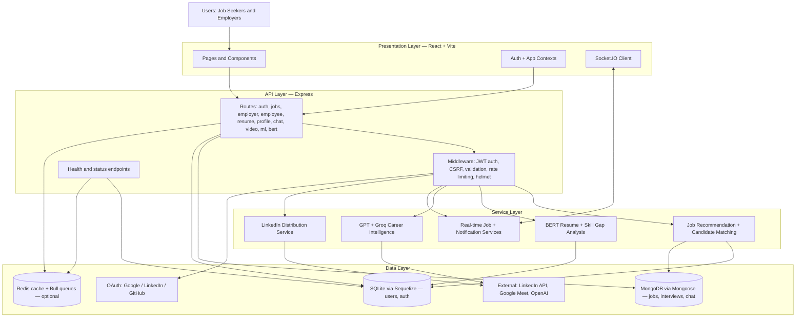

# CareerConnect AI

> v2.0.0 — AI-powered hiring and job-search platform for job seekers and employers.

CareerConnect AI combines resume intelligence, AI-driven job matching, real-time chat, video interviews, and analytics in a single full-stack application. It works out of the box with SQLite — no MongoDB or Redis required to get started.

---

## Features

### For Job Seekers

- AI resume parsing and analysis (BERT + Universal Sentence Encoder)
- Personalized job recommendations from three sources: internal DB, LinkedIn feed, GPT-generated listings
- One-click job applications with resume and cover letter
- Interview scheduling, confirmation, and video call integration (Google Meet)
- Career improvement suggestions powered by ML skill-gap analysis
- Real-time chat with recruiters via Socket.IO
- Saved jobs, job alerts, and application tracking
- Multi-language UI (i18n via react-i18next)

### For Employers

- Job posting with automatic LinkedIn distribution
- AI-powered candidate matching and ranking
- Applicant pipeline management with status tracking
- Interview scheduling and calendar management
- Company profile and team management
- Analytics dashboard with hiring funnel metrics
- Candidate search with skill-based filtering
- Real-time notifications for new applications

### Platform

- OAuth 2.0 via Google, LinkedIn, and GitHub
- JWT authentication with refresh-token rotation
- Role-based access control (jobseeker / employer)
- CSRF protection on all state-changing endpoints
- Rate limiting, helmet, and input validation on every route
- Hybrid storage: SQLite (users/auth) + MongoDB (jobs/interviews/chat)
- Redis caching (optional, graceful fallback when unavailable)

---

## Tech Stack

| Layer | Technology |
| --- | --- |
| Runtime | Node.js 18+, Express 4 |
| Frontend | React 18, Vite, Material UI v5, React Router v6 |
| State & Data | React Query, React Hook Form, Axios |
| Real-time | Socket.IO (server + client) |
| Animation & 3D | Framer Motion, Three.js (`@react-three/fiber`) |
| Charts | Recharts |
| Auth | Passport.js (JWT, Google, LinkedIn, GitHub), bcryptjs |
| Primary DB | SQLite via Sequelize |
| Document DB | MongoDB via Mongoose (optional) |
| Cache | Redis + Bull queue (optional) |
| AI / ML | TensorFlow.js, Universal Sentence Encoder, OpenAI API, Groq |
| PDF | pdf-parse, react-pdf |
| File uploads | Multer |
| Validation | express-validator, Zod |
| Logging | Winston |
| Process mgmt | PM2, Docker + Nginx |

---

## Architecture



### Request Lifecycle

1. React client calls an API route with a JWT Bearer token.
2. Express middleware validates the token, enforces CSRF (for mutations), and applies rate limits.
3. Route handler delegates to the appropriate service module.
4. Service reads/writes SQLite (user data) or MongoDB (jobs, interviews, chat).
5. AI modules (BERT, GPT, Groq) enrich recommendations and analysis on demand.
6. API returns a normalized JSON response; Socket.IO publishes real-time events when needed.

---

## File Structure

```text
careerconnect-ai/
├── src/
│   ├── client/                # React 18 frontend (Vite)
│   │   └── src/
│   │       ├── components/    # Reusable UI components (Layout, ErrorBoundary, Auth guards)
│   │       ├── contexts/      # AuthContext, AppContext, SocketContext
│   │       ├── hooks/         # Custom React hooks
│   │       ├── pages/         # Route-level pages (Auth, Employee, Employer, Jobs, Resume, …)
│   │       ├── services/      # Axios API clients (authService, jobService, resumeService, …)
│   │       ├── theme/         # Material UI theme config
│   │       ├── App.jsx        # Route composition with lazy loading
│   │       └── main.jsx       # App entrypoint
│   ├── config/                # Shared server config
│   ├── database/              # DB initialization and model wiring
│   ├── middleware/            # auth, validation, CSRF, rate limiting, error handling
│   ├── ml/                    # TensorFlow / BERT runtime helpers
│   ├── models/                # Sequelize (User) and Mongoose (Job, Interview, Chat) models
│   ├── routes/                # Express route modules (see API Routes below)
│   ├── server/                # Express bootstrap, Passport strategy wiring, Socket.IO setup
│   ├── services/              # Business and AI orchestration services
│   ├── utils/                 # Shared backend utilities
│   ├── workers/               # Background job processors (Bull queues)
│   └── __tests__/             # Backend tests (Jest)
├── scripts/                   # Setup, seed, test, and operational scripts
├── uploads/                   # Runtime file storage (resumes, avatars)
├── Dockerfile
├── docker-compose.yml         # Nginx load balancer + 4 app replicas
└── ecosystem.config.js        # PM2 cluster config
```

---

## API Routes

| Prefix | Module | Description |
| --- | --- | --- |
| `/api/auth` | `auth.js` | Register, login, logout, token refresh, OAuth callbacks, account deletion |
| `/api/employee` | `employee.js` | Dashboard stats, applications, saved jobs, job alerts, interviews, skill recommendations |
| `/api/employer` | `employer.js` | Dashboard, job CRUD, interview scheduling, candidate search, analytics, company profile |
| `/api/jobs` | `jobs.js` | Job search, recommendations, job detail, apply, save/unsave |
| `/api/resume` | `resume.js` | Upload, list, analysis, public resume, delete |
| `/api/profile` | `profile.js` | Get/update profile, skills, experience, education, avatar, stats |
| `/api/chat` | `chat.js` | Conversations, messages, attachments, real-time via Socket.IO |
| `/api/video` | `video.js` | Video interview scheduling, join/end session, Google Meet link generation |
| `/api/ml` | `ml.js` | BERT resume parsing, job recommendations, career improvement, skill gap analysis |
| `/api/bert` | `bertRoutes.js` | Direct BERT embedding and text analysis endpoints |
| `/api/gpt-jobs` | `gpt-jobs.js` | GPT/Groq-generated job listings and search |
| `/api/linkedin-jobs` | `linkedin-jobs.js` | LinkedIn job feed search |
| `/health` | — | Health check (DB + cache status) |
| `/api/status` | — | Authenticated status endpoint |

---

## Quick Start

### Prerequisites

- Node.js 18+
- npm 9+
- MongoDB (optional — falls back gracefully if unavailable)
- Redis (optional — falls back gracefully if unavailable)

### Option 1: Windows Fast Start

```bat
quick-start-dashboards.bat
```

### Option 2: Manual Setup

```bash
# 1. Install dependencies
npm install
cd src/client && npm install && cd ../..

# 2. Configure environment
copy .env.example .env      # Windows
cp .env.example .env        # macOS / Linux
# Edit .env — at minimum set JWT_SECRET and JWT_REFRESH_SECRET

# 3. Build the frontend
npm run build:client

# 4. Start the server
npm start
```

App: `http://localhost:3000`
Health check: `http://localhost:3000/health`

### Seed Test Accounts

```bash
node scripts/reset-users.js
```

| Role | Email | Password |
| --- | --- | --- |
| Job seeker | `test@test.com` | `test123` |
| Employer | `employer@test.com` | `employer123` |
| Admin test | `admin@test.com` | `admin123` |

---

## Configuration

Copy `.env.example` to `.env` and fill in the values. Required fields are marked.

```env
# ── Server ──────────────────────────────────────────────
NODE_ENV=development
PORT=3000
CLIENT_URL=http://localhost:3000

# ── Auth (REQUIRED) ─────────────────────────────────────
JWT_SECRET=<min 32 chars>
JWT_REFRESH_SECRET=<min 32 chars>
JWT_EXPIRE=1d
JWT_REFRESH_EXPIRE=30d

# ── Databases ────────────────────────────────────────────
MONGODB_URI=mongodb://localhost:27017/careerconnect_ai   # optional
REDIS_URL=redis://localhost:6379                         # optional

# ── OAuth (all optional) ─────────────────────────────────
GOOGLE_CLIENT_ID=
GOOGLE_CLIENT_SECRET=
GOOGLE_CALLBACK_URL=http://localhost:3000/api/auth/google/callback

LINKEDIN_CLIENT_ID=
LINKEDIN_CLIENT_SECRET=
LINKEDIN_CALLBACK_URL=http://localhost:3000/api/auth/linkedin/callback

GITHUB_CLIENT_ID=
GITHUB_CLIENT_SECRET=
GITHUB_CALLBACK_URL=http://localhost:3000/api/auth/github/callback

# ── AI Services (optional) ───────────────────────────────
OPENAI_API_KEY=
GROQ_API_KEY=
GROQ_BASE_URL=https://api.groq.com/openai/v1
GROQ_MODEL=llama-3.3-70b-versatile

# ── Google Meet (optional) ───────────────────────────────
GOOGLE_MEET_API_KEY=

# ── Dev helpers ──────────────────────────────────────────
ENABLE_DEV_OAUTH_MOCK=true
```

The server starts and operates fully without MongoDB, Redis, or any AI API keys — those features degrade gracefully when the services are unavailable.

---

## Development

Run backend and frontend in separate terminals:

```bash
# Terminal 1 — backend (auto-restarts with nodemon)
npm run dev

# Terminal 2 — frontend (Vite HMR)
cd src/client
npm run dev
```

Frontend dev server: `http://localhost:5173`
Backend API: `http://localhost:3000/api`

---

## Production

### Standard

```bash
npm run build:client   # Build React app into src/client/dist
npm start              # Serve everything from Express on port 3000
```

### PM2 Cluster

```bash
npm run start:pm2      # Start with PM2 (uses ecosystem.config.js)
npm run logs:pm2       # Tail logs
npm run restart:pm2    # Rolling restart
npm run stop:pm2       # Stop all instances
```

### Docker (Nginx + 4 replicas)

```bash
docker-compose up -d
```

The compose file starts Nginx as a load balancer across four app replicas. Pair with an external MongoDB and Redis service for production persistence.

---

## Testing and Linting

```bash
npm test                # Jest — backend unit tests
npm run test:watch      # Watch mode
npm run test:coverage   # Coverage report
npm run test:load       # Load test script

npm run lint            # ESLint
npm run lint:fix        # Auto-fix lint errors
npm run format          # Prettier
```

Frontend tests (from `src/client`):

```bash
cd src/client
npm test
```

---

## OAuth Setup

All three providers are optional. Enable only the ones you need.

Current provider status (updated May 2026):

- Google OAuth: working end-to-end
- LinkedIn OAuth: working end-to-end (uses OIDC userinfo; legacy endpoints as fallback)
- GitHub OAuth: working end-to-end

Verify providers:

```bash
node scripts/test-oauth.js
```

```bash
node -e "const axios=require('axios'); axios.get('http://127.0.0.1:3000/api/auth/test').then(r=>console.log(r.data.oauth));"
```

Set `ENABLE_DEV_OAUTH_MOCK=true` in `.env` to bypass real OAuth during local development.

---

## Security

- JWT access tokens (1-day expiry) + refresh tokens (30-day expiry) with rotation.
- CSRF protection (`csrfWithJWT` middleware) on all state-changing endpoints; skipped automatically for Bearer-token API clients.
- `helmet` sets secure HTTP headers on every response.
- Per-route and per-IP rate limiting via `express-rate-limit`.
- `express-validator` and `Zod` enforce input schemas at the API boundary.
- Passwords hashed with bcryptjs (12 rounds).
- OAuth tokens are never stored; only the resulting JWT is issued to the client.
- All file uploads are size-limited and type-checked by Multer before processing.

Do not commit `.env`, `*.sqlite`, or service account JSON files. All are in `.gitignore`.

---

## Troubleshooting

### Port 3000 already in use (Windows)

```powershell
$conn = Get-NetTCPConnection -LocalPort 3000 -State Listen -ErrorAction SilentlyContinue
if ($conn) {
    $conn | Select-Object -ExpandProperty OwningProcess -Unique | ForEach-Object { Stop-Process -Id $_ -Force }
}
```

### Upload directories missing

```bash
mkdir -p uploads/temp uploads/resumes uploads/avatars
```

### TensorFlow native bindings warning on startup

The `TensorFlow.js native bindings not available, using CPU fallback` message is expected in most environments. BERT features still work via the WASM/CPU backend — no action needed.

### MongoDB not available

Jobs and interviews fall back to an in-memory store (`localJobStore`) when MongoDB is unreachable. Data in the in-memory store does not persist across server restarts. Start MongoDB or set `MONGODB_URI` to a live instance for persistence.

### Redis not available

Caching and Bull queues are skipped when Redis is unreachable. The application continues to function without them.

### Verify the server is up

```bash
curl http://localhost:3000/health
```

---

## Additional Documentation

| File | Contents |
| --- | --- |
| `BERT_INTEGRATION.md` | BERT model setup, pool configuration, and caching |
| `OAUTH_SETUP_GUIDE.md` | Step-by-step OAuth provider registration |
| `REDIS_SETUP.md` | Redis install, config, and Bull queue details |
| `ENHANCED_DASHBOARD_DOCUMENTATION.md` | Dashboard features and widget reference |
| `IMPLEMENTATION_SUMMARY.md` | Architecture decisions and implementation notes |

---

## Project Goal

Deliver a fast, secure, and AI-assisted career platform that improves hiring and job-search outcomes for both sides of the market — without compromising reliability or requiring all optional services to be running.
