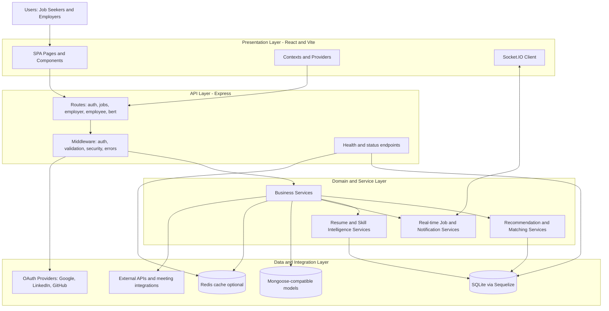

# CareerConnect AI

CareerConnect AI is an AI-powered hiring and job-search platform for both job seekers and employers.
It combines resume intelligence, smart matching, interview workflows, and analytics in one product.

## Highlights

- Unified experience for candidates and hiring teams
- AI-assisted resume analysis and role matching
- Secure auth stack with JWT + OAuth providers
- Real-time features with Socket.IO
- Production-ready backend + modern React frontend

## Tech Stack

- Backend: Node.js, Express, Sequelize, SQLite, Mongoose
- Frontend: React 18, Vite, Material UI, React Query
- AI: TensorFlow.js, Universal Sentence Encoder
- Ops: Docker, PM2, Nginx

## Architecture



Architecture summary:

- Frontend requests flow through route and middleware layers before reaching business services.
- Service modules encapsulate hiring, recommendation, resume-intelligence, and real-time logic.
- Persistence and integrations are isolated in the data/integration layer for maintainability.

### Runtime Flow

1. Client calls API route.
2. Middleware validates and authorizes request.
3. Route delegates to service.
4. Service reads/writes data and optionally invokes AI modules.
5. API returns normalized response; Socket.IO publishes real-time updates when needed.

## File Structure

Top-level layout:

```text
careerconnect-ai/
    src/
        client/                # React frontend
        config/                # Shared configuration
        database/              # DB initialization and models wiring
        middleware/            # Auth, validation, error and request middleware
        ml/                    # ML-specific helpers and runtime pieces
        models/                # Data models and schema definitions
        routes/                # Express route modules
        server/                # Server bootstrap and auth strategy wiring
        services/              # Core business and AI orchestration services
        utils/                 # Shared backend utilities
        workers/               # Background/async processing workers
        __tests__/             # Backend-focused tests
    public/                  # Built static assets served by backend
    uploads/                 # Runtime upload storage
    scripts/                 # Setup, seed, test, and operational scripts
    Dockerfile
    docker-compose.yml
    ecosystem.config.js
```

Frontend structure:

```text
src/client/src/
    components/              # Reusable UI components
    contexts/                # React contexts (including socket context)
    hooks/                   # Reusable frontend hooks
    pages/                   # Route-level pages
    providers/               # App-level providers
    services/                # Frontend API clients
    styles/                  # Global and shared styles
    theme/                   # Material UI theme configuration
    utils/                   # Frontend utilities
    App.jsx                  # Route composition
    main.jsx                 # App entrypoint
```

Backend service examples:

- Recommendation and matching: enhancedJobRecommendationService, candidateMatchingService
- Resume and skill intelligence: bertResumeService, skillGapAnalysisService, careerImprovementService
- Infra and support: bertCacheService, bertPoolManager, realTimeJobService

## Quick Start

### Option 1: Windows Fast Start

```bash
quick-start-dashboards.bat
```

### Option 2: Manual

```bash
npm install
cd src/client
npm install
cd ../..
copy .env.example .env
npm run build:client
npm start
```

App URL: `http://localhost:3000`
Health check: `http://localhost:3000/health`

## Local Test Accounts

If you need known credentials for local verification, seed/reset users with:

```bash
node scripts/reset-users.js
```

Default local accounts created by that script:

- Jobseeker: `test@test.com` / `test123`
- Employer: `employer@test.com` / `employer123`
- Admin-like test account: `admin@test.com` / `admin123`

## Configuration and Environment

Create `.env` from `.env.example` and provide at least:

- Server settings (PORT, NODE_ENV)
- JWT secret and auth-related values
- OAuth client IDs/secrets (Google, LinkedIn, GitHub if enabled)
- Optional Redis and AI provider settings

Do not commit secrets.

## Development

Backend:

```bash
npm run dev
```

Frontend:

```bash
cd src/client
npm run dev
```

## Build and Run (Production Mode)

```bash
npm run build:client
npm start
```

Website URL: `http://localhost:3000`

Quick health check:

```bash
curl http://localhost:3000/health
```

## OAuth Status (Updated Mar 2026)

Current provider status:

- Google OAuth: working end-to-end
- LinkedIn OAuth: working end-to-end
- GitHub OAuth: working end-to-end

Implementation notes:

- LinkedIn callback now prefers OIDC `userinfo` for `openid profile email` flows.
- Legacy LinkedIn profile/email endpoints are used only as fallback compatibility paths.
- Auth diagnostics endpoint now reports all providers (`google`, `linkedin`, `github`) consistently.

Verification commands:

```bash
node scripts/test-oauth.js
```

```bash
node -e "const axios=require('axios'); axios.get('http://127.0.0.1:3000/api/auth/test').then(r=>console.log(r.data.oauth));"
```

## Testing and Linting

```bash
npm test
npm run lint
```

Additional client checks can be run from `src/client` when needed.

## Key Routes

- Auth: `/api/auth/*`
- Candidate flows: `/api/employee/*`
- Employer flows: `/api/employer/*`
- Jobs: `/api/jobs/*`
- AI services: `/api/ml/*`, `/api/bert/*`
- Status: `/health`, `/api/status`

## Troubleshooting

- Port 3000 already in use (Windows PowerShell):

```powershell
$conn = Get-NetTCPConnection -LocalPort 3000 -State Listen -ErrorAction SilentlyContinue
if ($conn) {
    $pids = $conn | Select-Object -ExpandProperty OwningProcess -Unique
    foreach ($procId in $pids) { Stop-Process -Id $procId -Force }
}
```

- Server starts but resume upload paths are missing:

```bash
mkdir uploads/temp uploads/resumes uploads/avatars
```

- Verify backend startup quickly:

```bash
npm start
curl http://localhost:3000/health
```

## Security and Reliability

- JWT + OAuth support for secure authentication flows.
- Input validation and middleware-driven request guardrails.
- Centralized error handling and health endpoints for monitoring.
- Graceful service startup behavior with optional dependency fallback where applicable.

## Build, Deploy, and Operations

- Production build: `npm run build:client`
- Start server: `npm start`
- PM2 process mode: `npm run start:pm2`
- Docker mode: `docker-compose up -d`

For long-running environments, pair health checks with process supervision (PM2 or container orchestration).

## Docs

- `ENHANCED_DASHBOARD_DOCUMENTATION.md`
- `BERT_INTEGRATION.md`
- `IMPLEMENTATION_SUMMARY.md`
- `OAUTH_SETUP_GUIDE.md`
- `REDIS_SETUP.md`

## Project Goal

Deliver a fast, secure, and AI-assisted career platform that improves hiring and job-search outcomes without compromising reliability.
